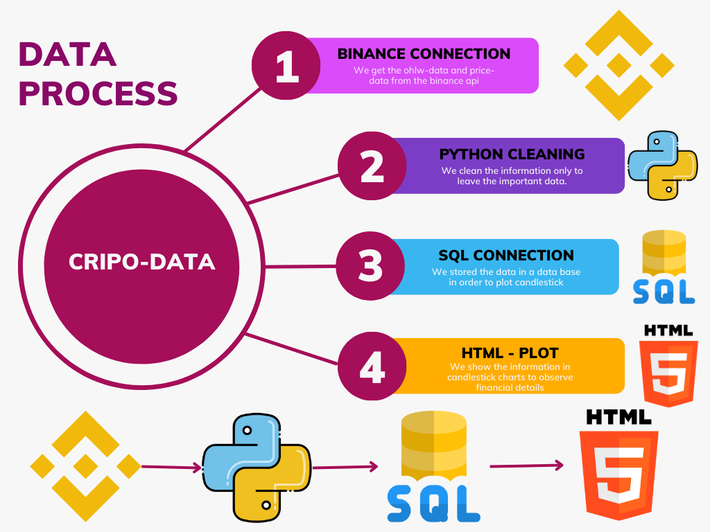
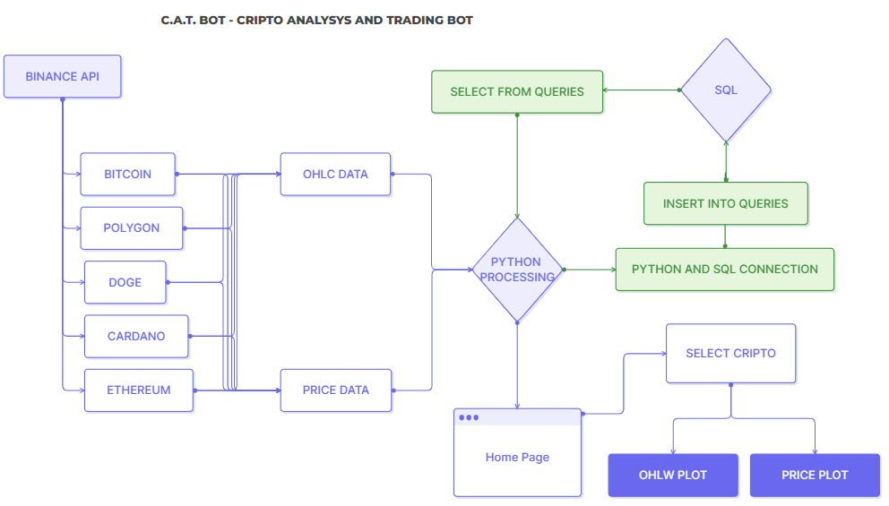
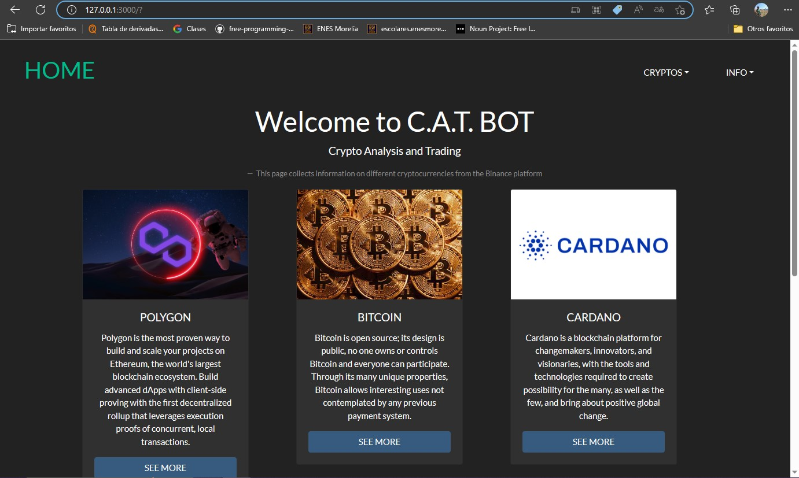
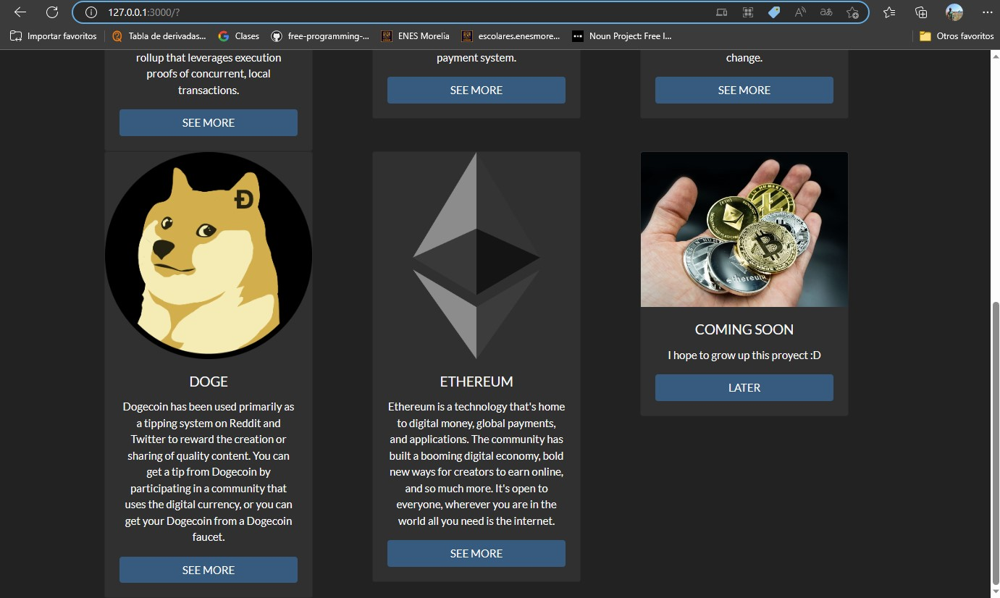
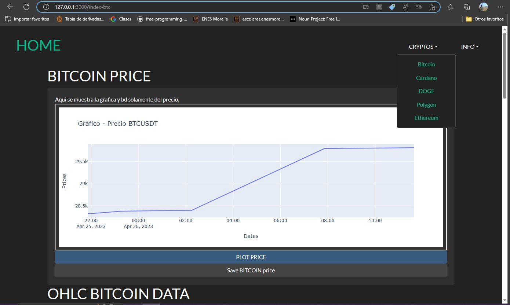
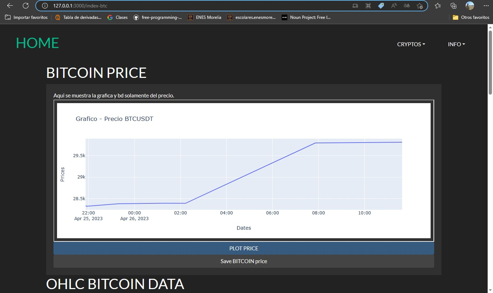
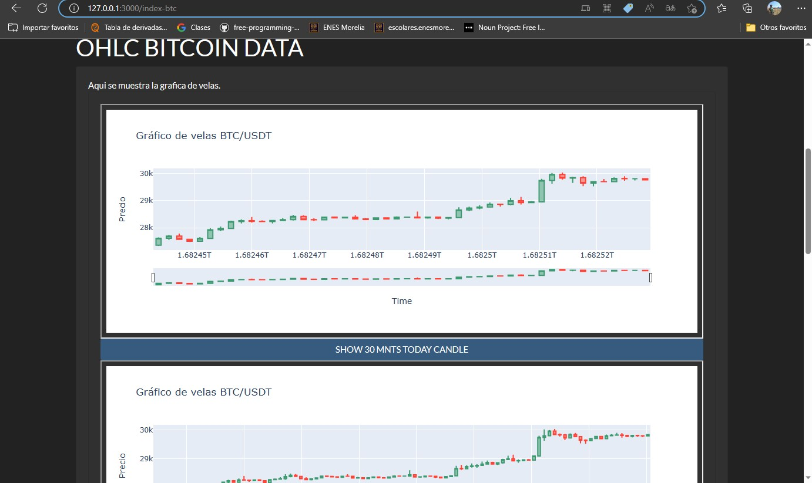
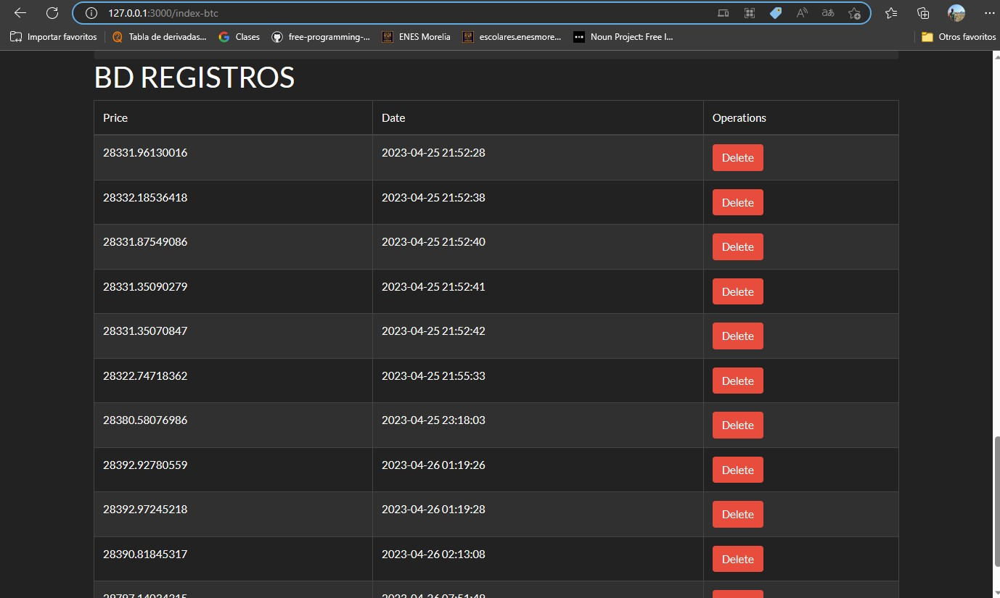

# 🖥 CRIPTO ANALYSIS AND TRADING BOT 🖥

# Students
David Alberto Aceves Sierra. davidaceves02@gmail.com

Cloud computing class. 
Student of information technologies in science, UNAM, ENES Morelia.

# Licence
GNU General Public License v3.0

# Requeriments
-python3

## Python libraries
-mplfinance
-python-binance
-time
-pandas
-plotly
-flask
-plotly

# 📋 Introduction 📋
Cryptocurrencies are a type of alternative currency or digital currency. Cryptocurrencies generally use decentralized control rather than a central bank digital currency (CBDC).

The control of each coin works through a decentralized database, usually blockchain, which serves as a public financial transaction database.

The first cryptocurrency that started operating was Bitcoin in 2009, and since then others have appeared with different characteristics such as Litecoin, Ethereum, BNB (Binance), Bitcoin Cash, Ripple, Dogecoin and many others.

Buying cryptocurrencies has its risk, the value changes constantly and without mathematical and statistical knowledge it quickly becomes a very complex problem. What professionals do is develop a plan in a defined period of time based on previous observations, the number of transactions and information obtained per second is so large that even for a group of 100 people.

Binance is a cryptocurrency exchange and company that provides a platform for trading over 100 digital assets.
Since 2020, it is considered the exchange platform with the highest commercial volume in the world.

An API is the set of protocols and definitions used to integrate and develop app software. The purpose of APIs is to link your products and services with others without knowing how they are implemented, which helps app development as well as saves time and money.
Binance offers an API to access your historical data and real-time transactions. This api allows up to a million requests per day.

Cryptocurrencies have revolutionized the financial landscape, offering a decentralized and secure means of digital transactions. With their growing popularity, it has become crucial to develop tools and algorithms to analyze and trade these digital assets effectively.

# The Significance of Candlestick Charts:
Candlestick charts are widely used in technical analysis to visualize price movements of cryptocurrencies over a specific time period. These charts provide valuable insights into market trends, price patterns, and potential trading opportunities. By developing software that can recreate candlestick charts using Binance API data, users can gain a comprehensive understanding of market dynamics.

# Leveraging Statistical Analysis:
In addition to candlestick charts, incorporating statistical analysis techniques can enhance the decision-making process. By utilizing mathematical models, indicators, and statistical tools, users can identify potential buy/sell signals, evaluate market volatility, and optimize their trading strategies.

# Automation for Efficiency:
Automation plays a crucial role in the fast-paced cryptocurrency market. By integrating the Binance API and database, your software can provide real-time data updates, automate trading orders, and execute predefined strategies. This saves time and allows users to capitalize on market opportunities promptly.

# Risk Management:
Managing risk is a fundamental aspect of successful cryptocurrency trading. Your software can include features such as stop-loss orders, risk assessment tools, and portfolio tracking functionalities. These elements will help users mitigate potential losses and ensure a disciplined approach to trading.

# User-Friendly Interface:
Design an intuitive and user-friendly interface that allows users to easily navigate through the software. Include features like customizable chart settings, real-time price updates, and a comprehensive dashboard to monitor portfolio performance.

# Security Considerations:
Given the sensitive nature of cryptocurrency transactions, prioritize the security of user data and implement robust encryption measures. Provide user authentication, two-factor authentication, and adhere to best practices in data privacy and protection.

# Backtesting and Historical Analysis:
Include features that enable users to backtest their trading strategies using historical data. By simulating past market conditions, users can evaluate the performance of their strategies and fine-tune them accordingly.

Educational Resources:
Consider integrating educational resources within the software, such as tutorials, articles, and guides on cryptocurrency trading strategies, technical analysis, and risk management. This will empower users with the knowledge and skills necessary to make informed trading decisions.

# Ongoing Development and Support:
Ensure a reliable support system for users, offering prompt assistance and addressing their queries or concerns. Regularly update the software to incorporate new features, security patches, and compatibility with the latest API versions.

# ✅ Justification ✅
With the current technological techniques and the existing computational power, it is possible to automate different actions within the cryptocurrency management platforms and the binance api, it is possible to create algorithms for the various trading strategies.

# 🤞 Goal 🤞
Create software that allows recreating the candlestick chart, also known as OHLC in order to automate the statistical analysis from the Binance API and our database.

Create an algorithm that gets at least 1 cent per transaction.

# 📖 Data flow diagram 📖

# 📖 On work examples 📖

# 🖇 References 🖇
Binance (2023, March 17) Binance. https://www.binance.com/

colaboradores de Wikipedia. (2023, March 17). Binance. Wikipedia, la enciclopedia libre. https://es.wikipedia.org/wiki/Binance
Binance (2023, March 17) Binance. https://www.binance.com/en/binance-api

¿Qué es una API? - Explicación de interfaz de programación de aplicaciones - AWS. (s. f.). Amazon Web Services, Inc. https://aws.amazon.com/es/what-is/api/

Euroinnova Business School. (2022, 19 mayo). Cómo apuntarse a la bolsa de educación. https://www.euroinnova.mx/blog/que-es-la-criptomoneda-y-como-funciona

Santander. (2022, 28 noviembre). ¿Qué son las criptomonedas y cómo funcionan? https://www.santander.com/es/stories/guia-para-saber-que-son-las-criptomonedas

# 🖥 CRIPTO ANALYSIS AND TRADING BOT 🖥

# Estudiantes
David Alberto Aceves Sierra. davidaceves02@gmail.com

Cloud computing class. 
Estudiante de tecnologías para la información en ciencias, UNAM, ENES Morelia.

# Licencia
GNU General Public License v3.0

# Requerimientos
-python3

## Librerias de python
-mplfinance
-python-binance
-time
-pandas
-plotly
-flask
-plotly

# Introducción
Las criptomonedas han revolucionado el panorama financiero, ofreciendo un medio de transacciones digitales descentralizado y seguro. Con su creciente popularidad, se ha vuelto crucial desarrollar herramientas y algoritmos para analizar y operar estos activos digitales de manera efectiva.

# Importancia de los gráficos de velas (candlestick):
Los gráficos de velas son ampliamente utilizados en el análisis técnico para visualizar los movimientos de precios de las criptomonedas en un período de tiempo específico. Estos gráficos brindan información valiosa sobre las tendencias del mercado, los patrones de precios y las posibles oportunidades de trading. Al desarrollar un software que pueda recrear los gráficos de velas utilizando los datos de la API de Binance, los usuarios pueden obtener una comprensión integral de la dinámica del mercado.

# Aprovechando el análisis estadístico:
Además de los gráficos de velas, incorporar técnicas de análisis estadístico puede mejorar el proceso de toma de decisiones. Al utilizar modelos matemáticos, indicadores y herramientas estadísticas, los usuarios pueden identificar posibles señales de compra/venta, evaluar la volatilidad del mercado y optimizar sus estrategias de trading.

# Automatización para mayor eficiencia:
La automatización juega un papel crucial en el mercado de criptomonedas, que se mueve rápidamente. Al integrar la API de Binance y la base de datos, tu software puede proporcionar actualizaciones de datos en tiempo real, automatizar órdenes de trading y ejecutar estrategias predefinidas. Esto ahorra tiempo y permite a los usuarios aprovechar oportunidades del mercado de manera oportuna.

# Gestión de riesgos:
Gestionar el riesgo es un aspecto fundamental del trading exitoso de criptomonedas. Tu software puede incluir funciones como órdenes de stop-loss, herramientas de evaluación de riesgos y seguimiento del rendimiento de la cartera. Estos elementos ayudarán a los usuarios a mitigar posibles pérdidas y asegurar un enfoque disciplinado en el trading.

# Interfaz amigable para el usuario:
Diseña una interfaz intuitiva y fácil de usar que permita a los usuarios navegar fácilmente por el software. Incluye características como configuraciones personalizables de los gráficos, actualizaciones de precios en tiempo real y un panel integral para monitorear el rendimiento de la cartera.

# Consideraciones de seguridad:
Dado el carácter sensible de las transacciones con criptomonedas, prioriza la seguridad de los datos de los usuarios e implementa sólidas medidas de encriptación. Proporciona autenticación de usuario, autenticación de dos factores y cumple con las mejores prácticas en privacidad y protección de datos.

# Backtesting y análisis histórico:
Incluye funciones que permitan a los usuarios realizar backtesting de sus estrategias de trading utilizando datos históricos. Al simular condiciones pasadas del mercado, los usuarios pueden evaluar el rendimiento de sus estrategias y ajustarlas en consecuencia.

# Recursos educativos:
Considera integrar recursos educativos dentro del software, como tutoriales, artículos y guías sobre estrategias de trading con criptomonedas, análisis técnico y gestión de riesgos. Esto capacitará a los usuarios con los conocimientos y habilidades necesarios para tomar decisiones informadas en el trading.

# Desarrollo continuo y soporte:
Asegura un sistema de soporte confiable para los usuarios, ofreciendo asistencia rápida y resolviendo sus consultas o inquietudes. Actualiza regularmente el software para incorporar nuevas características, parches de seguridad y compatibilidad con las últimas versiones de la API.
El control de cada moneda funciona a través de una base de datos descentralizada, usualmente blockchain, que sirve como una base de datos de transacciones financieras pública.

La primera criptomoneda que empezó a operar fue Bitcoin en 2009, y desde entonces han aparecido otras con diferentes características como Litecoin, Ethereum, BNB (Binance), Bitcoin Cash, Ripple, Dogecoin y muchas otras.

El comprar criptomonedas tiene su riesgo, el valor cambia constantemente y sin los conocimientos matemáticos y estadísticos se vuelve rápidamente un problema muy complejo. Lo que hacen los profesionales es elaborar un plan en un lapso de tiempo definido en base a previas observaciones, la cantidad de transacciones e información obtenida por segundo es tan grande que incluso para un grupo de 100 personas.

Binance es una empresa y plataforma de intercambio de criptomonedas que proporciona una plataforma para comerciar más de 100 activos digitales.
Desde 2020, es considerada la plataforma de intercambio con el mayor volumen comercial del mundo.

Una API es el conjunto de protocolos y definiciones que se usan para integrar y desarrollar el software de las apps. La finalidad de las API es unir sus productos y sus servicios con otros sin saber cómo se implementan, lo que ayuda al desarrollo de las apps además de ahorrar tiempo y dinero.
Binance ofrece una API para acceder sus datos historicos y transacciones en tiempo real. Esta api permite hasta un millón de solicitudes por dia.

# Justificación
Con las técnicas tecnológicas actuales y el poder computacional existente es posible automatizar diferentes acciones dentro de las plataformas manejadoras de criptomonedas y la api de binance es posible crear algoritmos para las diversas estrategias de trading.

# Objetivo
Crear un software que permita recrear el gráfico de velas, también conocido como OHLC para poder automatizar el análisis estádistico.
Crear un algoritmo que obtenga a lo menos 1 centavo por transacción.

# Diagrama de flujo de datos

# Referencias
Binance (2023, March 17) Binance. https://www.binance.com/

colaboradores de Wikipedia. (2023, March 17). Binance. Wikipedia, la enciclopedia libre. https://es.wikipedia.org/wiki/Binance

Binance (2023, March 17) Binance. https://www.binance.com/en/binance-api

¿Qué es una API? - Explicación de interfaz de programación de aplicaciones - AWS. (s. f.). Amazon Web Services, Inc. https://aws.amazon.com/es/what-is/api/

Euroinnova Business School. (2022, 19 mayo). Cómo apuntarse a la bolsa de educación. https://www.euroinnova.mx/blog/que-es-la-criptomoneda-y-como-funciona

Santander. (2022, 28 noviembre). ¿Qué son las criptomonedas y cómo funcionan? https://www.santander.com/es/stories/guia-para-saber-que-son-las-criptomonedas
