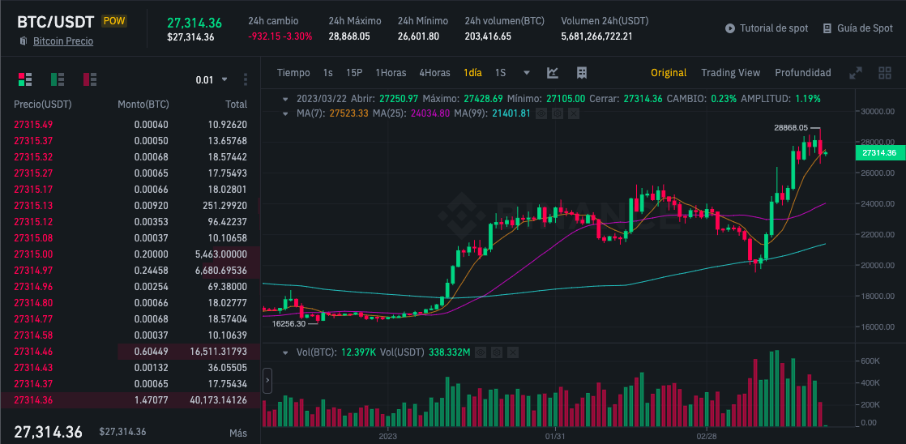

# 🖥 CRYPTO-STATS 🖥

# Student
David Alberto Aceves Sierra. davidaceves02@gmail.com

Cloud computing class. 
Student of information technologies in science, UNAM, ENES Morelia.

# Licence
GNU General Public License v3.0

# Requeriments
-python3

## Python libraries
-mplfinance
-python-binance
-time
-pandas

# 📋 Introduction 📋
Cryptocurrencies are a type of alternative currency or digital currency. Cryptocurrencies generally use decentralized control rather than a central bank digital currency (CBDC).

The control of each coin works through a decentralized database, usually blockchain, which serves as a public financial transaction database.

The first cryptocurrency that started operating was Bitcoin in 2009, and since then others have appeared with different characteristics such as Litecoin, Ethereum, BNB (Binance), Bitcoin Cash, Ripple, Dogecoin and many others.

Buying cryptocurrencies has its risk, the value changes constantly and without mathematical and statistical knowledge it quickly becomes a very complex problem. What professionals do is develop a plan in a defined period of time based on previous observations, the number of transactions and information obtained per second is so large that even for a group of 100 people.

Binance is a cryptocurrency exchange and company that provides a platform for trading over 100 digital assets.
Since 2020, it is considered the exchange platform with the highest commercial volume in the world.

An API is the set of protocols and definitions used to integrate and develop app software. The purpose of APIs is to link your products and services with others without knowing how they are implemented, which helps app development as well as saves time and money.
Binance offers an API to access your historical data and real-time transactions. This api allows up to a million requests per day.

# ✅ Justification ✅
With the current technological techniques and the existing computational power, it is possible to automate different actions within the cryptocurrency management platforms and the binance api, it is possible to create algorithms for the various trading strategies.

# 🤞 Goal 🤞
Create software that allows recreating the candlestick chart, also known as OHLC in order to automate the statistical analysis.
Create an algorithm that gets at least 1 cent per transaction.

# 🖇 References 🖇
Binance (2023, March 17) Binance. https://www.binance.com/

colaboradores de Wikipedia. (2023, March 17). Binance. Wikipedia, la enciclopedia libre. https://es.wikipedia.org/wiki/Binance
Binance (2023, March 17) Binance. https://www.binance.com/en/binance-api

¿Qué es una API? - Explicación de interfaz de programación de aplicaciones - AWS. (s. f.). Amazon Web Services, Inc. https://aws.amazon.com/es/what-is/api/

Euroinnova Business School. (2022, 19 mayo). Cómo apuntarse a la bolsa de educación. https://www.euroinnova.mx/blog/que-es-la-criptomoneda-y-como-funciona

Santander. (2022, 28 noviembre). ¿Qué son las criptomonedas y cómo funcionan? https://www.santander.com/es/stories/guia-para-saber-que-son-las-criptomonedas

# 🖥 CRYPTO-STATS 🖥

# Estudiante
David Alberto Aceves Sierra. davidaceves02@gmail.com

Cloud computing class. 
Estudiante de tecnologías para la información en ciencias, UNAM, ENES Morelia.

# Licencia
GNU General Public License v3.0

# Requerimientos
-python3

## Librerias de python
-mplfinance
-python-binance
-time
-pandas

# Introducción
Las criptomonedas son un tipo de divisa alternativa o moneda digital. Las criptomonedas generalmente usan control descentralizado en lugar de una moneda digital de un banco central (CBDC).

El control de cada moneda funciona a través de una base de datos descentralizada, usualmente blockchain, que sirve como una base de datos de transacciones financieras pública.

La primera criptomoneda que empezó a operar fue Bitcoin en 2009, y desde entonces han aparecido otras con diferentes características como Litecoin, Ethereum, BNB (Binance), Bitcoin Cash, Ripple, Dogecoin y muchas otras.

El comprar criptomonedas tiene su riesgo, el valor cambia constantemente y sin los conocimientos matemáticos y estadísticos se vuelve rápidamente un problema muy complejo. Lo que hacen los profesionales es elaborar un plan en un lapso de tiempo definido en base a previas observaciones, la cantidad de transacciones e información obtenida por segundo es tan grande que incluso para un grupo de 100 personas.

Binance es una empresa y plataforma de intercambio de criptomonedas que proporciona una plataforma para comerciar más de 100 activos digitales.
Desde 2020, es considerada la plataforma de intercambio con el mayor volumen comercial del mundo.

Una API es el conjunto de protocolos y definiciones que se usan para integrar y desarrollar el software de las apps. La finalidad de las API es unir sus productos y sus servicios con otros sin saber cómo se implementan, lo que ayuda al desarrollo de las apps además de ahorrar tiempo y dinero.
Binance ofrece una API para acceder sus datos historicos y transacciones en tiempo real. Esta api permite hasta un millón de solicitudes por dia.

# Justificación
Con las técnicas tecnológicas actuales y el poder computacional existente es posible automatizar diferentes acciones dentro de las plataformas manejadoras de criptomonedas y la api de binance es posible crear algoritmos para las diversas estrategias de trading.

# Objetivo
Crear un software que permita recrear el gráfico de velas, también conocido como OHLC para poder automatizar el análisis estádistico.
Crear un algoritmo que obtenga a lo menos 1 centavo por transacción.

# Referencias
Binance (2023, March 17) Binance. https://www.binance.com/

colaboradores de Wikipedia. (2023, March 17). Binance. Wikipedia, la enciclopedia libre. https://es.wikipedia.org/wiki/Binance

Binance (2023, March 17) Binance. https://www.binance.com/en/binance-api

¿Qué es una API? - Explicación de interfaz de programación de aplicaciones - AWS. (s. f.). Amazon Web Services, Inc. https://aws.amazon.com/es/what-is/api/

Euroinnova Business School. (2022, 19 mayo). Cómo apuntarse a la bolsa de educación. https://www.euroinnova.mx/blog/que-es-la-criptomoneda-y-como-funciona

Santander. (2022, 28 noviembre). ¿Qué son las criptomonedas y cómo funcionan? https://www.santander.com/es/stories/guia-para-saber-que-son-las-criptomonedas
